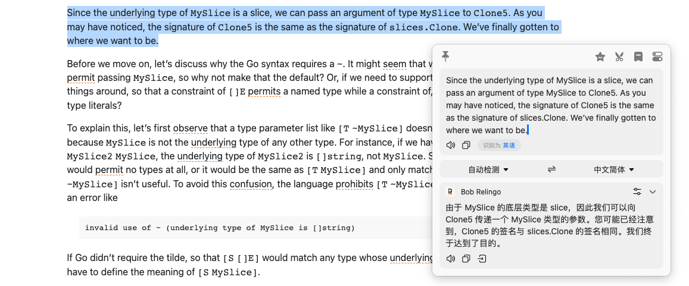
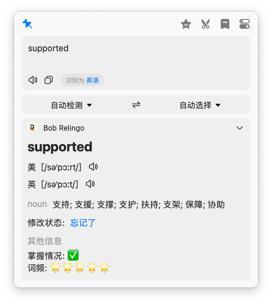

# Bob-Relingo

> bob的relingo联动，可显示relingo个人单词掌握情况。句子翻译使用deepL进行翻译。

[Bob](https://bobtranslate.com/)是一款macOS平台的翻译和OCR软件。

[relingo](https://relingo.net/)是一个网页翻译插件，在浏览网页时增加单词量，学习英语。

## 安装

1. 安装[Bob](https://apps.apple.com/cn/app/id1630034110)软件
2. 注册[Relingo](https://relingo.net)账号
3. 安装本插件
   1. Bob插件安装[教程](https://bobtranslate.com/guide/advance/plugin.html)
   2. 本插件下载[地址](https://github.com/solywsh/bob-relingo/releases)，点击`*.bobplugin`文件进行下载
4. 插件设置[设置](#设置)

## 效果

### 单词查询

单词查询使用了relingo的词库进行查询，可以根据个人relingo的单词掌握情况显示该单词是否已经掌握。

> ⚠️注意：
>
> - 为了保证开箱即用，如果需要使用relingo的单词查询，需要在[设置](#设置)里进行登录，**如果没登录，则默认使用deepL的查询接口**，将不会显示单词信息。
> - 由于relingo并没有收录所有接口，**如果relingo没有查询到单词也将使用deepL的查询接口直接翻译**。

#### 修改状态

如果需要对单词掌握状态进行修改，点击修改状态栏的**[已掌握/忘记了]**，即可进行状态修改。

### 句子查询

由于relingo普通用户只能使用google翻译，并且CN用户需要开启全局代理才可以使用，付费用户使用的deepl和openai的翻译需要将数据传回relingo进行翻译，为了减轻relingo方服务器的压力，所以这里使用[akl7777777/bob-plugin-akl-deepl-free-translate](https://github.com/akl7777777/bob-plugin-akl-deepl-free-translate)的deepL翻译实现，并默认使用deepl进行翻译。

（后续版本会跟进其他翻译接口）

## 设置

### relingo登录

1. 输入您的relingo注册邮箱
2. 点击验证
3. 打开邮箱，接收验证码，填入邮箱验证码
4. 再次点击验证

> 考虑部分同学可能对抓包比较陌生，暂不考虑直接通过token验证的方式，如果您觉得token登录更为方便，请提交issue，后续会考虑支持。

### 查词模式

> 前提：已经登录relingo

在选中单个单词时，会进入查词模式（在登录relingo的前提下）。查词模式分为`relingo全词本查询`和`relingo个人词本查询`。

- **relingo全词本查询**：relingo全词本查询会查询relingo收录的所有单词。注意，为了避免网页显示过多翻译，relingo并没有收录所有单词，如果插件没有获得relingo查询结果，将会触发deepL翻译。建议使用该模式。

- **relingo个人词本查询**：relingo个人词本查询会查询你个人在relingo中添加的单词本，如陌生单词、雅思、托福、四六级和考研。同理，如果没查询到，那么将调用deepL查询。建议考研、备考者使用，避免记过多无用单词。
  - relingo在网页中显示生词表示的时候使用的就是该查词模式的接口。

单词在词库查询得到的结果：

单词在未词库查询得到的结果：

### 额外显示

> 前提：已经登录relingo

relingo提供了单词的词频和你是否已经掌握该单词的信息，这里提供了开关显示额外信息的选项。

额外显示开：

额外显示关：

### 显示相关词汇

如果开启了显示相关词汇，则会显示该单词的过去式，过去分词等其它相关单词变体。

### 更新relingo配置

在之后的使用中，如果您在relingo进行了设置，并需要同步配置到bob插件中（主要是词本的设置），需要更新插件用户配置。

- 自动更新：在更新/添加token的24小时后，如果再次使用翻译功能，将会自动刷新token和用户配置。
- 手动更新：在设置中点击验证即可。

### 用户注销

请将插件卸载然后重新安装。

## 其他功能

### IP地址查询

> 选中需要查询的内容时，Bob会自动将内容符号处理

## 感谢

[relingo](https://relingo.net/)：一个网页翻译插件，在浏览网页时增加单词量，学习英语。

[akl7777777/bob-plugin-akl-deepl-free-translate](https://github.com/akl7777777/bob-plugin-akl-deepl-free-translate)：bob的deepL免费翻译插件。

[cip.cc](https://cip.cc)：IP地址查询网站
