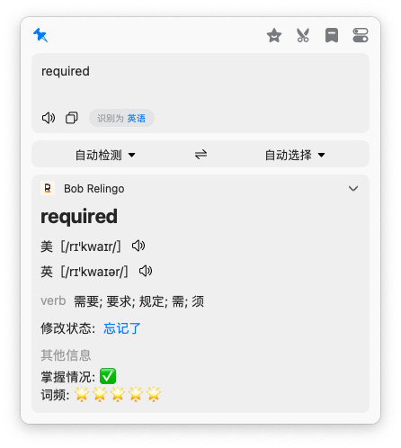
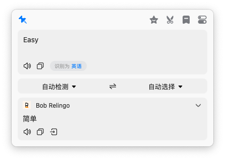

# Bob-Relingo

> bob的relingo联动，可显示relingo个人单词掌握情况。句子翻译使用deepL进行翻译。

## 效果

### 单词查询

单词查询使用了relingo的词库进行查询，可以根据个人relingo的单词掌握情况显示该单词是否已经掌握。

(v0.0.4版本会考虑可以修改单词掌握情况，并同步自relingo)

⚠️注意：

- 为了保证开箱即用，如果需要使用relingo的单词查询，需要在[设置](##设置)里进行登录，如果没登录默认使用deepL的查询接口。
- 由于relingo并没有收录所有接口，**如果relingo没有查询到单词将使用deepl的查询接口直接翻译**。

### 句子查询

由于relingo普通用户只能使用google翻译，并且CN用户需要开启全局代理才可以使用，付费用户使用的deepl和openai的翻译需要将数据传回relingo进行翻译，为了减轻relingo方服务器的压力，所以这里使用[akl7777777/bob-plugin-akl-deepl-free-translate](https://github.com/akl7777777/bob-plugin-akl-deepl-free-translate)默认使用deepl进行翻译。

（后续版本会跟进其他翻译接口）

## 设置

### relingo登录

1. 输入您的relingo注册邮箱
2. 点击验证
3. 打开邮箱，接收验证码，填入邮箱验证码
4. 再次点击验证

> 考虑部分同学可能对抓包比较陌生，暂不考虑直接通过token验证的方式，如果您觉得token登录更为方便，请提交issue，后续会考虑支持。

### 查词模式

> 前提：已经登录relingo

在选中单个单词时，会进入查词模式（在登录relingo的前提下）。查词模式分为`relingo全词本查询`和`relingo个人词本查询`。

- **relingo全词本查询**：relingo全词本查询会查询relingo收录的所有单词。注意，relingo并没有收录所有单词，如果没有获得relingo查询结果，将会触发deepL翻译。建议使用该模式。

- **relingo个人词本查询**：relingo个人词本查询会查询你个人在relingo中添加的单词本，如陌生单词、雅思、托福、四六级和考研。同理，如果没查询到，那么将调用deepL查询。建议考研、备考者使用，避免记过多无用单词。
  - relingo在网页中显示生词表示的时候使用的就是改查词模式的接口。

单词在词库查询得到的结果：

单词在未词库查询得到的结果：

### 额外显示

> 前提：已经登录relingo

relingo提供了单词的词频和你是否已经掌握该单词的信息，这里提供了开关显示额外信息的选项。

额外显示开：

额外显示关：

### 更新relingo配置

在之后的使用中，如果您在relingo进行了设置，并需要同步配置到bob插件中（主要是词本的设置），在设置中点击验证即可。

（后续更新会根据时间自动进行更新配置）

### 用户注销

请将插件卸载然后重新安装。

## 感谢

[relingo](https://relingo.net/)：一个网页翻译插件，在浏览网页时增加单词量，学习英语。

[akl7777777/bob-plugin-akl-deepl-free-translate](https://github.com/akl7777777/bob-plugin-akl-deepl-free-translate)：bob的deepL免费翻译插件。
